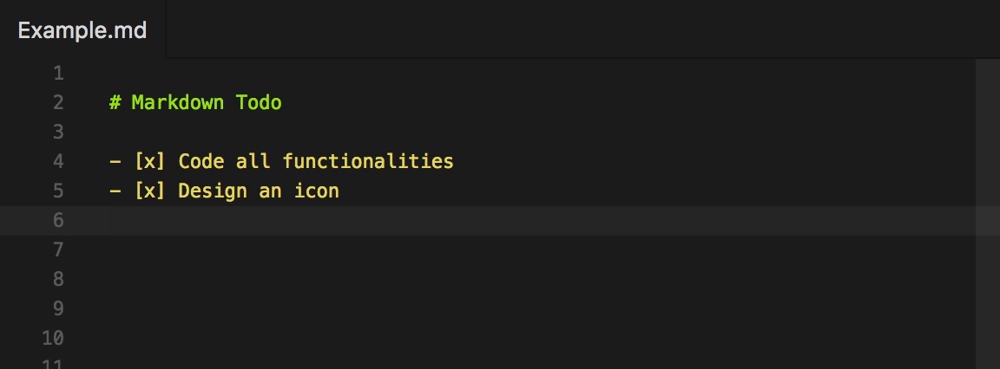

# Markdown Todo

<p align="center">
	
</p>

Manage todo lists inside markdown files with ease.

## Install

Follow the instructions in the [Marketplace](https://marketplace.visualstudio.com/items?itemName=fabiospampinato.vscode-markdown-todo), or run the following in the command palette:

```sh
ext install fabiospampinato.vscode-markdown-todo
```

## Usage

It adds 2 commands to the command palette:

```js
'Markdown Todo: Toggle Todo' // Toggle a todo
'Markdown Todo: Toggle Done' // Toggle a todo as done
```

It adds 2 shortcuts when editing a `Markdown` file:

```js
'Cmd/Ctrl+Enter' // Triggers `Markdown Todo: Toggle Todo`
'Alt+D' // Triggers `Markdown Todo: Toggle Done`
```

## Settings

```js
{
  "markdown.todo.symbols.bullet": "-", // Todo bullet symbol
  "markdown.todo.symbols.done": "x" // Todo done symbol
}
```

## Demo



## Related

- **[Todo+](https://marketplace.visualstudio.com/items?itemName=fabiospampinato.vscode-todo-plus)**: Manage todo lists with ease. Powerful, easy to use and customizable.
- **[Noty](https://github.com/fabiospampinato/noty)**: Autosaving sticky note with support for multiple notes without needing multiple windows.

## License

MIT © Fabio Spampinato
